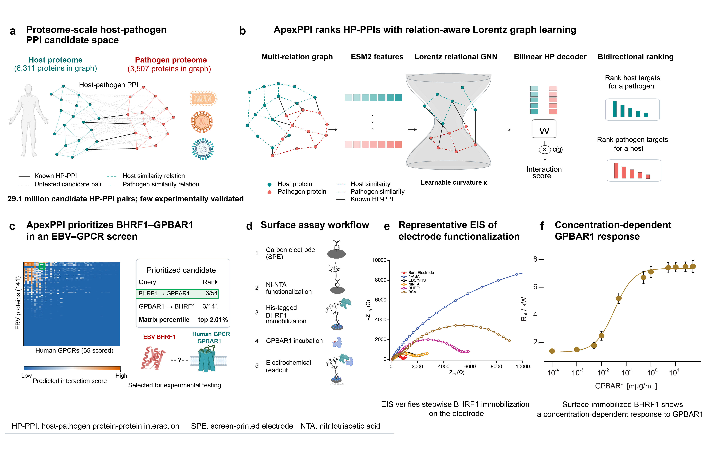

# ApexPPI

ApexPPI ranks candidate host-pathogen protein interactions using ESM2 protein
features and a relation-aware Lorentz graph neural network.

[**Download the v0.1.0 model bundle**](https://github.com/XiaoqiongXia/apexppi/releases/download/v0.1.0/apexppi-bundle-v0.1.0.tar.gz)
· [Release page](https://github.com/XiaoqiongXia/apexppi/releases/tag/v0.1.0)



*ApexPPI model architecture and experimental prioritization workflow.*

## Install

ApexPPI requires Python 3.10 or newer.

```bash
python -m venv .venv
source .venv/bin/activate
pip install -e .
```

Install a platform-specific PyTorch build first if you need CUDA.

## Download the model

The release contains the trained checkpoint, processed graph, protein tables,
and model metrics. Download and verify both release files:

```bash
curl -LO https://github.com/XiaoqiongXia/apexppi/releases/download/v0.1.0/apexppi-bundle-v0.1.0.tar.gz
curl -LO https://github.com/XiaoqiongXia/apexppi/releases/download/v0.1.0/apexppi-bundle-v0.1.0.tar.gz.sha256
sha256sum --check apexppi-bundle-v0.1.0.tar.gz.sha256
tar -xzf apexppi-bundle-v0.1.0.tar.gz
```

Keep the checkpoint and processed graph from the same bundle together.

## Use

```python
from apexppi import ApexPPIPredictor

predictor = ApexPPIPredictor.from_bundle("apexppi-bundle-v0.1.0", device_name="cpu")

pair = predictor.score_pair("O00170", "Q69027")
print(pair["interaction_probability"])

top_hosts = predictor.score_pathogen_against_hosts("Q69027").head(50)
print(top_hosts[["host_uniprot", "interaction_probability"]])
```

The command-line interface supports pair scoring and host ranking:

```bash
apexppi-predict \
  --bundle-dir apexppi-bundle-v0.1.0 \
  --host-uniprot O00170 \
  --pathogen-uniprot Q69027 \
  --device cpu

apexppi-predict \
  --bundle-dir apexppi-bundle-v0.1.0 \
  --pathogen-uniprot Q69027 \
  --top-k 50 \
  --output-tsv results/q69027_host_ranking.tsv
```

With the v0.1.0 bundle, the pair example reports
`"known_hpidb_positive": true` and an interaction probability of approximately
`0.91019`.

## Model and data

The v0.1.0 graph contains 8,311 host proteins and 3,507 pathogen proteins. The
model uses 480-dimensional inputs, 256-dimensional hidden states, two
relation-attention Lorentz layers, and a gated bilinear decoder. The saved run
reached 0.9613 test average precision and 0.9551 test ROC AUC.

Predictions are limited to proteins in the released graph. Scores are intended
for experimental prioritization, not as confirmed interactions or clinical
evidence.

## Rebuild and train

The scripts expose their full options through `--help`:

```bash
python scripts/preprocess_hpidb.py --help
python scripts/generate_embeddings.py --help
python scripts/build_graph.py --help
python scripts/train_apexppi.py --help
```

Run the test suite with:

```bash
pip install -e '.[dev,esm,plot]'
pytest -q
```
